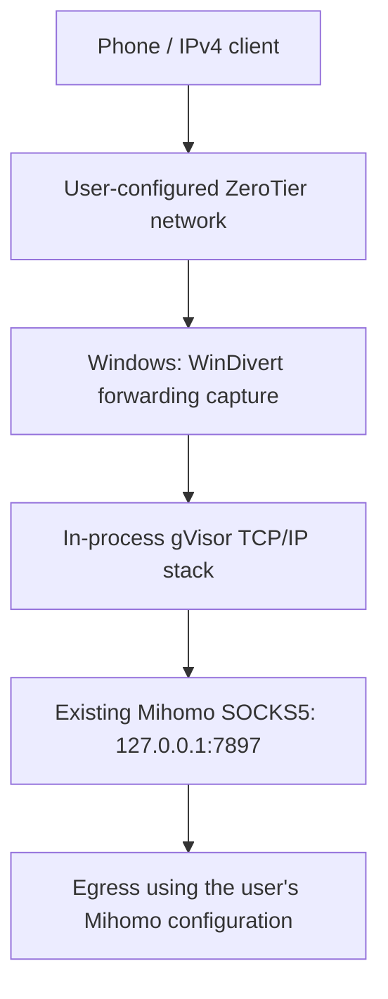

# ZeroBridge Mihomo

[简体中文](README.md) · **English**

**A Windows IPv4 forwarding gateway from ZeroTier to Mihomo / Clash.** Receive client traffic over ZeroTier and pass it to a SOCKS5 proxy the user already operates or has configured.

Windows amd64 · TCP / UDP / DNS · No TUN · Desktop dashboard and tray · MIT

[v0.3.0 experimental prerelease](https://github.com/Luase233/zerobridge-mihomo/releases/tag/v0.3.0) · [Desktop and tray](DESKTOP.md) · [Changelog](CHANGELOG.md) · [Autostart](AUTOSTART.md) · [Validation scope](VALIDATION.md)

**Reboot fix on `main`:** if Windows reassigns the ZeroTier interface index, the gateway resolves the active adapter from the configured Windows ZeroTier address and client subnet. `interface_index` remains a hint in `gateway.json`; startup requires exactly one matching active ZeroTier adapter.

> This project provides local forwarding and protocol conversion only. **It does not provide or operate a VPN service, proxy nodes, subscriptions or an Internet egress service.** Users configure their own ZeroTier network and upstream proxy. See the [scope-of-use statement](DISCLAIMER.md).

## What does it solve?

On cellular connections, an iPhone does not have the manual HTTP proxy setting available for Wi-Fi. Even when ZeroTier routes its default traffic to Windows, Mihomo's HTTP/SOCKS mixed port cannot directly accept ordinary forwarded IP packets.

ZeroBridge Mihomo connects those layers. WinDivert captures one client's IPv4 packets at `NETWORK_FORWARD`; an in-process TCP/IP stack converts them into SOCKS5 connections for the existing Mihomo instance. It creates no TUN/Wintun adapter, does not enable Clash TUN, and does not change Windows default routes.



**Experimental status.** IPv4 egress, video playback and process recovery were verified in one Windows/iPhone deployment. An independent security audit, long-term reliability and an actual Windows reboot acceptance test remain outstanding. This is not an official product provided or supported by ZeroTier, Mihomo, Clash, WinDivert or tun2socks.

## Features

- **iPhone control:** matching Home Screen web interface with QR pairing, node search and manual group selection; desktop command/result synchronization. See the [mobile guide](MOBILE.md).
- **Desktop and tray:** bilingual dashboard, packet-rate / active-connection charts, logs, confirmed Start/Stop with UAC and a separate user-logon task. See the [desktop guide](DESKTOP.md).
- **One configured client:** filter `ip and ip.SrcAddr == <source_ip>` at the forwarding layer. Windows-local connections, Mihomo outbound connections and ZeroTier's outer transport do not match it.
- **TCP and UDP:** SOCKS CONNECT and UDP ASSOCIATE. The upstream and UDP relay are restricted to loopback. There is no direct-connect fallback after proxy failure.
- **DNS:** ordinary forwarded TCP/UDP port 53 requests are redirected to the configured public resolver over SOCKS. Local delivery and direct same-subnet traffic are outside this capture scope.
- **Protocol handling:** reuses tun2socks core's in-process gVisor stack for segmentation, retransmission, IPv4 fragmentation and return-packet checksums, without loading its TUN device.
- **Failure protection:** an independent guard drops matching traffic if the proxy exits. If the guard exits, the proxy retains its capture handle and enters drop mode.
- **Optional autostart:** a SYSTEM task with High priority, dependency waiting and child-process recovery.

## Before you start

| Item | Requirement |
| --- | --- |
| System | Windows amd64; development validation used Windows 11 |
| Build tools | Go 1.26.3+; validated with Go 1.26.8 |
| ZeroTier | Authorized, reachable client and Windows members on the same private IPv4 `/24` |
| Client default route | Configured in ZeroTier via the Windows ZeroTier address, not by changing the Windows host's default route |
| Windows forwarding | IPv4 forwarding enabled on the ZeroTier interface; actual interface index verified |
| Mihomo | Working, unauthenticated SOCKS at `127.0.0.1:7897`; UDP also requires upstream node support |
| Client toggle | Enable Default Route **OFF** during installation, stopping, rebooting and NAT restoration |

The supplied lifecycle templates target an **existing dedicated `ZeroTierNAT`**. They are not a general network installer and do not create ZeroTier routes, enable forwarding, adjust the firewall or configure Clash.

## Build and configure

### 1. Get the source and build

```powershell
git clone https://github.com/Luase233/zerobridge-mihomo.git
Set-Location zerobridge-mihomo

# Download and verify the official runtime; no driver loading or network changes.
& .\scripts\Fetch-Runtime.ps1
# If downloads need the existing proxy, append -Proxy http://127.0.0.1:7897

go test ./... -count=1 -timeout=60s
go vet ./...
go build -trimpath -o bin/zt-gateway.exe ./cmd/zt-gateway

# First-time setup only; do not overwrite an existing real configuration.
Copy-Item .\gateway.example.json .\gateway.json
```

### 2. Configure your installation

Edit `gateway.json`. Example addresses and interface indices are placeholders, not values to use unchanged on a real network.

| Field | Meaning / current constraint |
| --- | --- |
| `source_ip` | The client's ZeroTier IPv4 address |
| `windows_ip` | The Windows ZeroTier IPv4 address, in the same `/24` as the client |
| `interface_index` | The actual Windows ZeroTier interface index |
| `proxy` | Currently fixed at `127.0.0.1:7897` |
| `dns` | Public IPv4 DNS on port 53; default `1.1.1.1:53` |
| `mtu` | Default 1280; range 1280–1500 |
| `max_flows` | Default 256; range 1–1024 |
| `idle_timeout_seconds` | Default 120; range 15–600 |
| `windivert_dll` | Default `runtime/WinDivert.dll`, relative to the configuration file |

**Review the NAT template separately.** `scripts/Nat.ps1` still restricts operations to `ZeroTierNAT` and the example prefix `10.147.20.0/24`. Before using another subnet, review and adjust `$expectedPrefix` there and the `Expected` fields in `scripts/Inspect.ps1`. Changing JSON alone does not authorize management of another NAT; mismatches are rejected.

### 3. Run read-only checks

Keep the phone's Default Route OFF:

```powershell
& .\scripts\Inspect.ps1
& .\bin\zt-gateway.exe check -config .\gateway.json
```

These check interfaces, forwarding, NAT, driver signature and hashes, then test TCP DNS, UDP DNS and HTTPS egress over the existing SOCKS endpoint. Probes contact the configured resolver and api.ipify.org; they do not load the driver or modify networking.

## Start, verify and stop

### Manual startup

Run from the reviewed working copy. Administrator privileges are required; the launcher can request UAC elevation:

```powershell
& .\scripts\Invoke-Operation.ps1 -Operation Start -PhoneDefaultRouteIsOff
```

Order: preflight → read-only driver smoke test → immutable NAT backup → removal of the specified dedicated NAT → guard readiness → proxy readiness. Removing the NAT interrupts other clients that depend on it. This command does not create a startup task.

External pools are rejected by default. Append `-ExternalPoolsAreAutomatic` only when you can explicitly confirm no pools or port mappings were manually added. Unsupported dependencies such as static mappings are still rejected; restoration does not preserve transient port allocations or sessions.

### Verify client access

1. Read the launcher's returned `ResultPath`: require `Status=completed` and `Success=true`.
2. Confirm `state/runtime.json` reports `ready` and the Windows host network still works.
3. Enable the phone's Default Route, open [api.ipify.org](https://api.ipify.org), and compare its exit IP with Mihomo's.
4. Separately test DNS, applications and IPv6 behavior. `ready` establishes process readiness only; UDP flow counts do not prove UDP replies.

Traffic follows Mihomo's current mode and node selection. A `DIRECT` match in rule mode can still use direct egress.

### Stop and restore

**Turn the phone's Default Route OFF first**, then run:

```powershell
& .\scripts\Invoke-Operation.ps1 -Operation Stop -PhoneDefaultRouteIsOff
```

The script verifies ownership, stops proxy then guard, and restores/verifies the original NAT. Failures do not trigger automatic NAT restoration. Keep `state` and `state/ZeroTierNAT.original.clixml` until recovery is verified.

**If the supervisor task is installed, use [Manage.ps1 and the autostart guide](AUTOSTART.md), not the manual stop command above.** See [OPERATIONS.md](scripts/OPERATIONS.md) for detailed NAT lifecycle behavior.

## Known limitations and security boundaries

- IPv4 TCP/UDP only; no IPv6 or ICMP proxying. Failure to reach one IPv6 endpoint does not establish the absence of IPv6 bypass on every network.
- Active mode rejects all explicit Windows NATs. Do not delete unrelated WSL, Hyper-V or other NATs to bypass the check.
- Private, loopback, link-local and shared-address destinations are rejected except ordinary unfragmented DNS. SOCKS UDP FRAG and domain-form UDP relays are unsupported; fake-IP requires a matching upstream mapping.
- Idle connections expire and applications may need to reconnect. The flow limit is not comprehensive resource-exhaustion protection.
- The guard is not a persistent firewall. Both processes exiting, driver failure, reboot and startup gaps have no permanent blocking guarantee.
- Source-address filtering is not independent device authentication. Restrict ZeroTier membership and access to the existing proxy listener.
- A SYSTEM installation must not be writable by ordinary users. Administrator privileges and a kernel driver are required; functional tests alone do not establish security or reliability.

## Documentation and feedback

| Document | Contents |
| --- | --- |
| [简体中文 README](README.md) | Complete Chinese introduction and instructions |
| [Autostart](AUTOSTART.md) / [简体中文](AUTOSTART.zh-CN.md) | High priority, supervision, status, lifecycle and removal |
| [CHANGELOG](CHANGELOG.md) | Version history |
| [VALIDATION](VALIDATION.md) | Tested behavior and outstanding verification |
| [THIRD_PARTY](THIRD_PARTY.md) | Dependency sources and licenses |
| [Scope of use / 项目使用声明](DISCLAIMER.md) | Functional scope, third-party services and user responsibilities |

Feedback is welcome through [Issues](https://github.com/Luase233/zerobridge-mihomo/issues). Include the version, Windows version, reproduction steps and a sanitized error summary. Do not upload real configurations, full logs, NAT backups, subscription data or credentials.

## License and scope of use

Source is distributed under the [MIT License](LICENSE). Dependencies including WinDivert retain their own licenses. This repository excludes real device configurations, operational records, recovery backups, build outputs and third-party driver binaries.

**ZeroBridge Mihomo provides local traffic forwarding and protocol conversion only. It does not provide or operate VPN, commercial proxy, node, subscription, account or Internet egress services, and makes no promise of anonymity or bypassing network access restrictions.** Users must obtain and configure ZeroTier and upstream services themselves, complying with applicable laws, network policies and service terms. The project is provided “as is” under MIT; see [DISCLAIMER.md](DISCLAIMER.md) for the complete bilingual statement.
