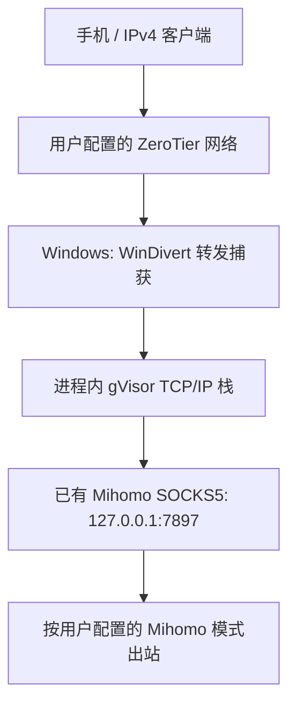

# ZeroBridge Mihomo

**简体中文** · [English](README.en.md)

**面向 Windows 的 ZeroTier → Mihomo / Clash IPv4 转发网关。** 让客户端通过 ZeroTier 到达 Windows，再将其转发流量交给用户已有的 SOCKS5 代理。

Windows amd64 · TCP / UDP / DNS · 无 TUN · 桌面面板与托盘 · MIT

[v0.3.0 实验性预发布](https://github.com/Luase233/zerobridge-mihomo/releases/tag/v0.3.0) · [界面与托盘](DESKTOP.md) · [更新日志](CHANGELOG.md) · [开机自启](AUTOSTART.zh-CN.md) · [验证范围（English）](VALIDATION.md)

**重启修复已进入 `main`：** Windows 重新分配 ZeroTier 网卡编号时，网关按配置的 Windows ZeroTier 地址及客户端子网识别当前接口。`gateway.json` 的 `interface_index` 仍保留为提示值；必须匹配唯一的活动 ZeroTier 网卡才会启动。

> 本项目仅提供本地转发与协议转换功能，**不提供或运营 VPN 服务、代理节点、订阅或网络出口服务**。ZeroTier 网络和上游代理均由使用者自行配置。完整说明见[项目使用声明](DISCLAIMER.md)。

## 解决什么问题？

iPhone 在蜂窝网络下没有 Wi-Fi 设置中的手动 HTTP 代理入口。即使 ZeroTier 已将默认流量送到 Windows，Mihomo 的 HTTP/SOCKS 混合端口也不能直接接收普通转发 IP 包。

ZeroBridge Mihomo 补上这一环：使用 WinDivert 的 `NETWORK_FORWARD` 层捕获指定客户端的 IPv4 转发包，在进程内 TCP/IP 栈中转换为 SOCKS5 连接，再交给现有 Mihomo。它不创建 TUN/Wintun 网卡，不开启 Clash TUN，也不修改 Windows 默认路由。



**当前为实验版本。** 已在一个 Windows / iPhone 环境中验证 IPv4 出口、视频播放及进程恢复；尚未完成独立安全审计、长期稳定性或实际 Windows 重启验收。这不是 ZeroTier、Mihomo、Clash、WinDivert 或 tun2socks 官方提供或支持的产品。

## 功能

- **iPhone 手机控制：** 同款网页可添加到主屏幕，扫码配对、搜索并切换 Clash 手动代理组节点；电脑端同步命令与确认结果。见[手机控制说明](MOBILE.md)。
- **交互界面与托盘：** 中英文运行面板、收发包速率 / 活动连接图表、日志入口、带确认和 UAC 的启动/停止，以及独立的用户登录自启。见[桌面使用说明](DESKTOP.md)。
- **单客户端范围：** filter 为 `ip and ip.SrcAddr == <source_ip>`，只作用于转发层。Windows 本机、Mihomo 出站和 ZeroTier 外层连接不匹配这一过滤器。
- **TCP 与 UDP：** TCP 使用 SOCKS CONNECT；UDP 使用 UDP ASSOCIATE。上游和 UDP relay 限于本机回环地址，没有代理失败后直连的回退。
- **DNS：** 转发路径上的普通 TCP/UDP 53 请求改写到配置的公网 DNS，并经 SOCKS 发送。本地接收及同网段直接通信不在捕获范围内。
- **协议处理：** 复用 tun2socks core 的进程内 gVisor 栈，处理分段、重传、IPv4 分片与回包校验和，不加载其 TUN 设备。
- **故障保护：** proxy 退出时，独立 guard 丢弃匹配流量；guard 退出时，proxy 保留捕获句柄并进入丢弃模式。
- **可选自启：** SYSTEM 计划任务、High 优先级、依赖等待和子进程恢复。

## 开始前确认

| 项目 | 要求 |
| --- | --- |
| 系统 | Windows amd64；开发验证使用 Windows 11 |
| 编译工具 | Go 1.26.3+；已验证 Go 1.26.8 |
| ZeroTier | 客户端与 Windows 已授权、互通，位于同一私有 IPv4 `/24` |
| 客户端默认路由 | ZeroTier 网络中指向 Windows 的 ZeroTier 地址；不是修改 Windows 本机默认路由 |
| Windows 转发 | ZeroTier IPv4 forwarding 已启用，实际接口编号已确认 |
| Mihomo | 现有 `127.0.0.1:7897` SOCKS 可用、无认证；UDP 还需上游节点支持 |
| 客户端开关 | 安装、停止、重启和恢复 NAT 前，Enable Default Route 保持 **OFF** |

附带启停模板面向**已经存在专用 `ZeroTierNAT`** 的环境，不是通用网络安装器。脚本不会自动创建 ZeroTier 路由、开启 forwarding、调整防火墙或配置 Clash。

## 构建与配置

### 1. 获取源码并构建

```powershell
git clone https://github.com/Luase233/zerobridge-mihomo.git
Set-Location zerobridge-mihomo

# 下载并校验官方运行库；不加载驱动、不修改网络。
& .\scripts\Fetch-Runtime.ps1
# 如下载需要已有本地代理，可追加 -Proxy http://127.0.0.1:7897

go test ./... -count=1 -timeout=60s
go vet ./...
go build -trimpath -o bin/zt-gateway.exe ./cmd/zt-gateway

# 首次配置时执行；不要覆盖已有真实配置。
Copy-Item .\gateway.example.json .\gateway.json
```

### 2. 填写本机配置

编辑 `gateway.json`。示例地址和接口编号只是占位值，不能直接用于真实网络。

| 字段 | 含义 / 当前限制 |
| --- | --- |
| `source_ip` | 要代理的客户端 ZeroTier IPv4 地址 |
| `windows_ip` | Windows 的 ZeroTier IPv4 地址，与客户端同一 `/24` |
| `interface_index` | Windows ZeroTier 网卡的实际接口编号 |
| `proxy` | 当前固定为 `127.0.0.1:7897` |
| `dns` | 公网 IPv4 DNS，端口 53；默认 `1.1.1.1:53` |
| `mtu` | 默认 1280，范围 1280–1500 |
| `max_flows` | 默认 256，范围 1–1024 |
| `idle_timeout_seconds` | 默认 120，范围 15–600 |
| `windivert_dll` | 默认 `runtime/WinDivert.dll`，相对配置文件解析 |

**NAT 模板需单独核对。** `scripts/Nat.ps1` 仍限定 `ZeroTierNAT` 和示例前缀 `10.147.20.0/24`。使用其他网段前，审阅并调整 `$expectedPrefix`，以及 `scripts/Inspect.ps1` 的 `Expected` 字段。只修改 JSON 不会让脚本管理另一条 NAT；不匹配时会拒绝操作。

### 3. 只读预检

手机 Default Route 保持 OFF：

```powershell
& .\scripts\Inspect.ps1
& .\bin\zt-gateway.exe check -config .\gateway.json
```

检查接口、转发状态、NAT、驱动签名和哈希，并通过现有 SOCKS 测试 TCP DNS、UDP DNS 和 HTTPS 出口。探测访问配置的 DNS 与 api.ipify.org，不加载驱动、不修改网络。

## 启动、验证与停止

### 手动启动

在已审阅的工作目录执行，需要管理员权限；启动器可请求 UAC：

```powershell
& .\scripts\Invoke-Operation.ps1 -Operation Start -PhoneDefaultRouteIsOff
```

顺序为：预检 → 只读驱动试运行 → 保存不可覆盖的 NAT 备份 → 移除指定专用 NAT → guard 就绪 → proxy 就绪。移除 NAT 会中断依赖它的其他客户端；此操作不会创建开机任务。

有外部端口池时默认拒绝。只有确认从未手工添加池或端口映射后，才可按需追加 `-ExternalPoolsAreAutomatic`。静态映射等未覆盖依赖仍会被拒绝；恢复不保留临时端口分配或连接会话。

### 验证客户端访问

1. 读取启动器返回的 `ResultPath`：要求 `Status=completed`、`Success=true`。
2. 确认 `state/runtime.json` 为 `ready`，Windows 本机网络正常。
3. 开启手机 Default Route，访问 [api.ipify.org](https://api.ipify.org)，比较手机与 Mihomo 的出口 IP。
4. 分别验证 DNS、常用应用和 IPv6 行为。`ready` 仅代表进程就绪；UDP 流计数不能证明已经收到 UDP 回复。

流量沿用 Mihomo 当前模式和节点选择。规则模式中的 `DIRECT` 仍可能直接出网。

### 停止与恢复

**先关闭手机 Default Route**，再执行：

```powershell
& .\scripts\Invoke-Operation.ps1 -Operation Stop -PhoneDefaultRouteIsOff
```

脚本核验进程所有权，依次停止 proxy、guard，然后恢复并校验原 NAT。失败时不会自动恢复 NAT；请保留 `state` 和 `state/ZeroTierNAT.original.clixml`，直到恢复验证完成。

**已安装监督任务时，使用 [Manage.ps1 与自启说明](AUTOSTART.zh-CN.md)，不要直接使用上述手动停止命令。** NAT 运维细节见 [OPERATIONS.md（English）](scripts/OPERATIONS.md)。

## 已知限制与安全边界

- 仅 IPv4 TCP/UDP，不支持 IPv6 或 ICMP 代理。一次 IPv6 测试失败不代表所有网络都不存在 IPv6 旁路。
- 活动模式拒绝任何显式 Windows NAT；不要删除不相关的 WSL、Hyper-V 或其他 NAT 来绕过检查。
- 除普通未分片 DNS 外，私网、回环、链路本地和共享地址目标会被拒绝。SOCKS UDP FRAG、域名型 UDP relay 不支持；fake-IP 依赖上游一致的映射。
- 闲置连接会超时，应用可能需要重连；容量上限不是完整的资源耗尽防护。
- guard 不是持久防火墙。两个进程同时退出、驱动故障、重启和启动早期都没有永久阻断保证。
- 源地址过滤不是独立设备认证；应限制 ZeroTier 网络成员和现有代理入口的访问范围。
- SYSTEM 自启目录必须限制普通用户写入。程序需要管理员权限和内核驱动，不能仅凭功能测试宣称安全可靠。

## 文档与反馈

| 文档 | 内容 |
| --- | --- |
| [English README](README.en.md) | 完整英文介绍和操作步骤 |
| [开机自启](AUTOSTART.zh-CN.md) / [English](AUTOSTART.md) | High 优先级、监督任务、状态、启停和撤销 |
| [CHANGELOG](CHANGELOG.md) | 版本记录 |
| [VALIDATION（English）](VALIDATION.md) | 已验证事项和待验证边界 |
| [THIRD_PARTY（English）](THIRD_PARTY.md) | 依赖来源和许可证 |
| [项目使用声明 / Scope of use](DISCLAIMER.md) | 功能范围、第三方服务和使用责任 |

欢迎通过 [Issues](https://github.com/Luase233/zerobridge-mihomo/issues) 反馈。请提供版本、Windows 版本、复现步骤和脱敏后的错误摘要；不要上传真实配置、完整运行日志、NAT 备份、订阅或凭据。

## 许可证与使用声明

源码采用 [MIT 许可证](LICENSE)，WinDivert 等依赖保留各自许可证。本仓库不包含真实设备配置、运行记录、恢复备份、编译产物或第三方驱动二进制。

**ZeroBridge Mihomo 仅提供本地流量转发与协议转换功能，不提供或运营 VPN、商业代理、节点、订阅、账号或网络出口服务，也不承诺匿名性或突破网络访问限制。** 使用者需自行取得并配置 ZeroTier 和上游代理，遵守适用法律、网络管理要求及相关服务条款。项目按 MIT 许可证以“现状”提供；完整中英双语声明见 [DISCLAIMER.md](DISCLAIMER.md)。
